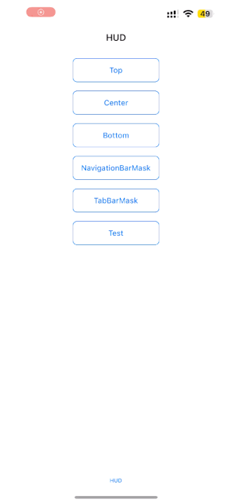

<div align=leading></div>

A powerful and easy to use HUD view.

## Preview



## Requirements

- iOS 12.0+
- Xcode 12+
- Objective-C/Swift

## Install

### Manner

Clone Code，Dragging the 'Sources' folder into the project to use it.


## Using

```Swift
HUD.contentBackgroundColor = .clear
HUD.contentStyle = .dark
HUD.show(status: .success, title: "Your title here", subtitle: "Your subtitle or message", direction: .horizontal, position: .center)
```

## Supplement

If you are just starting to use `SwiftyHUD`, and during the development process you need to support certain features, please make sure to first search the documentation or source code to confirm whether the desired features are already supported. Please do not ask questions without even looking at the documentation and source code, as this is a waste of time for everyone. If the desired features are not supported, feel free to raise an Issue for discussion, or implement them yourself and submit a Pull Request.

This repository is kept up-to-date, and will support the latest classification selection effects in a timely manner. If you have any suggestions or questions during use, you can contact me through the following means:

Email: robot.amiee@gmail.com

If you like it, please give it a star❤️.

## License

SwiftyHUD is released under the MIT license.
